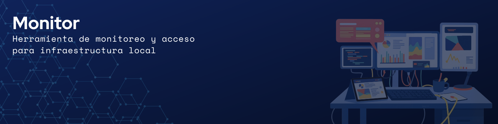

**Monitor** es una herramienta de escritorio desarrollada en WPF bajo el patrón de arquitectura MVVM, diseñada para simplificar las tareas de monitoreo, acceso y administración básica de dispositivos dentro de una infraestructura local. La aplicación proporciona una experiencia de uso sencilla e intuitiva, permitiendo centralizar el acceso a recursos internos y realizar verificaciones rápidas de conectividad desde una única interfaz. Su diseño prioriza la flexibilidad de configuración, la facilidad de mantenimiento y la capacidad de adaptación ante cambios en la infraestructura, ofreciendo una solución liviana y práctica tanto para usuarios técnicos como para aquellos con menor experiencia en entornos de administración y soporte.

---

# Índice

* **[1 - Características principales](#link-características-principales-1)**

* **[2 - Tecnologías utilizadas](#link-tecnologías-utilizadas-2)**

* **[3 - Funciones](#link-funciones-3)**

* **[4 - Arquitectura](#link-arquitectura-4)**

* **[5 - Finalidad del proyecto](#link-finalidad-del-proyecto-5)**

* **[Capítulo 6 - Planificación](#link-planificación-6)**

---


# :link: CARACTERÍSTICAS PRINCIPALES (1)

- Monitoreo de conectividad mediante ping
- Integración con accesos VNC
- Escaneo de puertos mediante Nmap
- Descubrimiento de dispositivos en subred
- Interfaz dinámica basada en Grid
- Arquitectura MVVM
- Persistencia local con SQLite
- Configuración flexible y desacoplada
- Componentes visuales dinámicos
- Herramientas orientadas a infraestructura y redes
  
---


# :link: TECNOLOGÍAS UTILIZADAS (2)

## UI / Frontend
- WPF (.NET)
- XAML
- Data Binding
- Dynamic Grid Layouts

## Arquitectura
- MVVM
- Dependency Injection
- ICommand / RelayCommand

## Persistencia y datos
- SQLite
- XML Processing

## Networking
- Ping Monitoring
- Nmap Integration
- VNC Integration

---


# :link: FUNCIONES (3)

## 🧩 Mecánica Compartida de Interfaz

Varios módulos de la aplicación comparten una misma estructura basada en una Grid configurable que permite construir interfaces dinámicas y reutilizables. Este enfoque proporciona una experiencia consistente entre los distintos menús y facilita la personalización de la distribución de componentes.

### 📐 Configuración mediante Guías

La aplicación incluye un modo de edición denominado **"Mostrar Guías"**, que permite visualizar los espacios disponibles dentro de la Grid y agregar componentes de forma interactiva mediante menús contextuales. Estas guías son utilizadas únicamente durante la configuración y permanecen ocultas durante el uso normal de la aplicación.

### 🧱 Componentes Disponibles

Los módulos pueden incorporar dos tipos principales de elementos:

#### 🔘 Botones

Componentes interactivos cuyo comportamiento depende del menú en el que se encuentren. Entre sus usos se incluyen accesos VNC, apertura de interfaces web, monitoreo de conectividad y ejecución de acciones sobre dispositivos.

Los botones pueden mostrar indicadores visuales de estado:

| Estado   | Significado                           |
| -------- | ------------------------------------- |
| 🟢 Verde | El dispositivo responde correctamente |
| 🔴 Rojo  | El dispositivo no responde            |

#### 🏷️ Títulos

Elementos destinados exclusivamente a la organización visual de la interfaz, permitiendo agrupar y separar secciones para mejorar la legibilidad y navegación.

### 🏗️ Diseño Modular

La interfaz se apoya en una arquitectura visual multicapa que permite superponer elementos de configuración y componentes dinámicos sin afectar el funcionamiento operativo. Este diseño facilita la reorganización de la interfaz y la incorporación de nuevos elementos manteniendo una estructura flexible y escalable.


## 🖥️ Menú de Accesos VNC

Módulo orientado a centralizar accesos remotos hacia dispositivos dentro de la infraestructura local mediante conexiones VNC.

Este menú está destinado exclusivamente a dispositivos accesibles mediante clientes VNC.


### Funcionalidades

- Acceso rápido a dispositivos remotos
- Organización de accesos por sectores o categorías
- Monitoreo visual de conectividad
- Administración visual de accesos internos

Puede utilizarse para organizar accesos hacia servidores, equipos de oficina y distintos equipos de infraestructura accesibles mediante VNC.

> Este módulo utiliza la mecánica compartida de interfaz descrita en la sección [🧩 Mecánica Compartida de Interfaz](#-mecánica-compartida-de-interfaz)

---

## ⚖️ Menú Balanzas

Módulo orientado al monitoreo de dispositivos de pesaje dentro de la red local.

### Funcionalidades

- Monitoreo de conectividad
- Indicadores visuales de estado
- Detección rápida de desconexiones
- Vista centralizada de dispositivos

> Algunas funcionalidades presentes en entornos de producción fueron retiradas o limitadas en esta versión por motivos de seguridad.

> Este módulo utiliza la mecánica compartida de interfaz descrita en la sección [🧩 Mecánica Compartida de Interfaz](#-mecánica-compartida-de-interfaz)

---

## 🌐 Menú Dispositivos

Módulo destinado a centralizar accesos y monitoreo de distintos equipos de infraestructura accesibles mediante interfaces web por dirección IP desde el navegador.

Este menú está pensado principalmente para dispositivos que poseen paneles de administración web integrados.


### Funcionalidades

- Monitoreo de conectividad
- Apertura rápida de interfaces web
- Acceso directo mediante navegador
- Organización centralizada de dispositivos

Puede utilizarse con impresoras, access points, switches, teléfonos IP, firewalls, routers y distintos dispositivos de red con interfaces administrativas web.

> Este módulo utiliza la mecánica compartida de interfaz descrita en la sección [🧩 Mecánica Compartida de Interfaz](#-mecánica-compartida-de-interfaz)

---

## 🔍 Menú Análisis de Subred

Herramienta destinada al descubrimiento básico de dispositivos dentro de una subred local.

### Funcionamiento

El usuario define una subred objetivo:

```text
192.168.1
```

La aplicación:

- Escanea direcciones IP
- Realiza pruebas de conectividad
- Detecta hosts accesibles

### Información obtenida

- IP detectadas
- Estado de conectividad
- Dispositivos activos

---

## 🚪 Menú Escaneo de Puertos

Integración con Nmap para realizar análisis más avanzados de red.

### Funcionalidades

- Ejecución de instrucciones Nmap
- Procesamiento automático de XML
- Visualización de resultados dentro de la interfaz

### Información procesada

- Dirección MAC
- Hostname
- Sistema operativo detectado
- Puertos abiertos
- Servicios detectados

### Casos de uso

Diagnóstico de red, auditorías básicas, verificación de servicios activos y detección rápida de puertos expuestos.

---

## ⚙️ Menú Configuración

Panel destinado a administrar parámetros dinámicos de la aplicación.

### Configuraciones disponibles

- Gateway de red
- Ruta Nmap
- Ruta VNC

Esto permite adaptar la herramienta a distintos entornos sin necesidad de recompilar la aplicación.


# :link: ARQUITECTURA (4)

El proyecto fue desarrollado utilizando el patrón arquitectónico MVVM (Model-View-ViewModel). Si bien para una aplicación de este tamaño una arquitectura de este tipo puede resultar más compleja de lo estrictamente necesario, se optó por implementarla como parte de un proceso de aprendizaje orientado a comprender su funcionamiento, beneficios y desafíos en un entorno real de desarrollo.

La primera versión de la aplicación fue construida siguiendo un enfoque tradicional basado en XAML y Code-Behind, donde la lógica de la interfaz se encontraba directamente en los archivos .xaml.cs. A medida que el proyecto evolucionó, se realizó una refactorización gradual hacia una arquitectura MVVM, separando responsabilidades y desacoplando la lógica de negocio de la capa de presentación.

Esta transición permitió adquirir experiencia práctica en la implementación de patrones de diseño ampliamente utilizados en aplicaciones WPF modernas, así como comprender las ventajas que aportan en términos de organización del código, mantenibilidad y escalabilidad.

## Beneficios de MVVM
Separación clara de responsabilidades.
Mejor mantenibilidad del código.
Mayor facilidad para incorporar nuevas funcionalidades.
Mejor reutilización de componentes.
Facilita la realización de pruebas y futuras refactorizaciones.
Mayor desacoplamiento entre la interfaz y la lógica de negocio.

---


# :link: FINALIDAD DEL PROYECTO (5)

## Objetivos del software

Monitor fue desarrollado como una pequeña herramienta enfocada en:

- Mejorar la comodidad operativa
- Simplificar tareas repetitivas
- Centralizar accesos internos
- Facilitar monitoreo básico
- Reducir tiempos de acceso y validación
- Brindar una interfaz sencilla para usuarios menos experimentados

Para cumplir estos objetivos, la aplicación fue diseñada como una solución liviana, sostenible y fácil de configurar, capaz de adaptarse a cambios en la infraestructura local y ofrecer una experiencia de uso rápida y práctica en entornos operativos reales.

## Objetivos personales

A nivel personal, este proyecto representó una oportunidad para profundizar en el desarrollo de aplicaciones de escritorio modernas utilizando tecnologías del ecosistema .NET, con un enfoque orientado tanto al aprendizaje técnico como al diseño de una herramienta funcional para entornos reales.

Uno de los principales objetivos fue trabajar sobre una interfaz visual minimalista, clara y fluida, utilizando XAML como tecnología principal para la construcción de la UI. El proyecto permitió explorar en profundidad el funcionamiento de WPF, comprendiendo conceptos relacionados a renderizado visual, composición de interfaces, estilos, bindings y manejo dinámico de componentes.

También se hizo especial énfasis en la implementación de una arquitectura MVVM lo más desacoplada y limpia posible, buscando mantener una correcta separación de responsabilidades entre vistas, lógica de negocio y manejo de estados. Esto permitió desarrollar una base más mantenible, escalable y sencilla de extender a futuro.

Otro de los desafíos personales del proyecto fue trabajar con elementos dinámicos dentro de una Grid, logrando implementar un sistema visual compuesto por múltiples capas de componentes. Esto me permitió generar una interfaz configurable por el usuario, con componentes que podían agregarse dinámicamente dentro de distintas secciones del panel.

Durante el desarrollo también se incorporaron tecnologías y conceptos nuevos, entre ellos:

- Inyección de dependencias para desacoplar servicios y mejorar la organización general de la aplicación.
- Integración con SQLite como base de datos liviana y embebida para persistencia local de configuraciones y datos.
- Integración con Nmap para ejecutar análisis de red directamente desde la aplicación.
- Procesamiento de resultados XML generados por Nmap para extraer y mostrar información relevante de manera estructurada.

El proyecto también sirvió como práctica para trabajar con:

- Monitoreo de conectividad mediante ping.
- Interacción con procesos externos del sistema operativo.
- Manipulación dinámica de componentes visuales.
- Diseño de herramientas orientadas a infraestructura y redes.
- Organización de proyectos de escritorio bajo una arquitectura mantenible.

En conjunto, el desarrollo de Monitor funcionó tanto como una herramienta de uso práctico como un espacio de aprendizaje técnico para experimentar distintas tecnologías, patrones y enfoques de diseño dentro del ecosistema WPF y .NET.


---


# :link: SEGURIDAD (5)

Algunas funcionalidades utilizadas internamente en ambientes de producción fueron retiradas o limitadas dentro de esta versión por motivos de seguridad.

